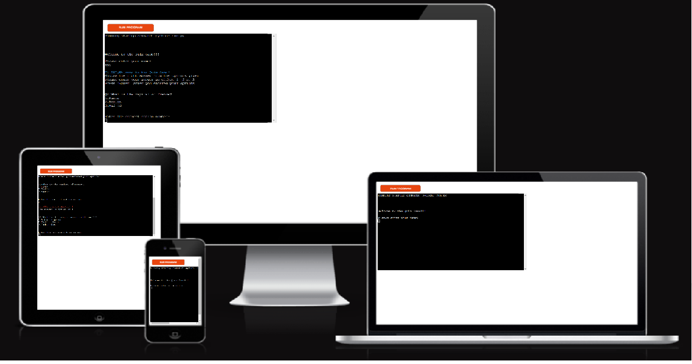
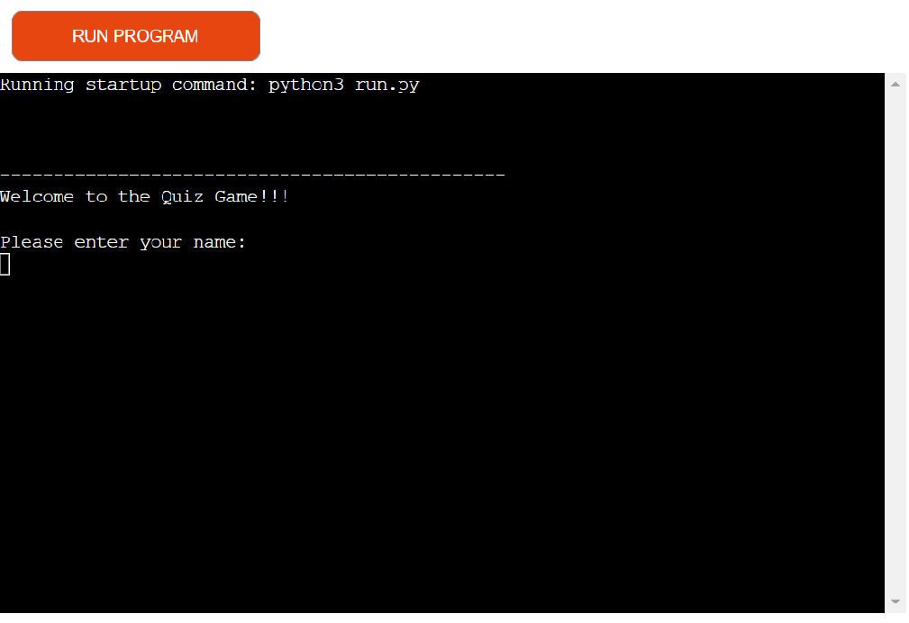
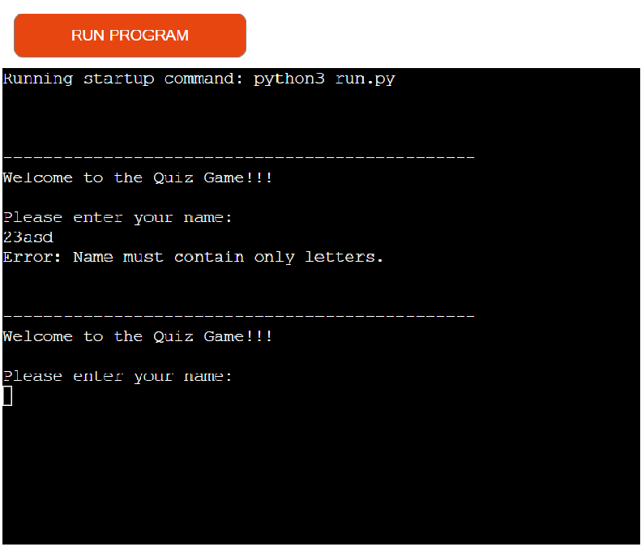
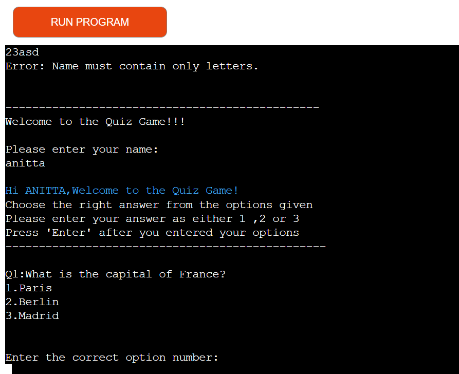
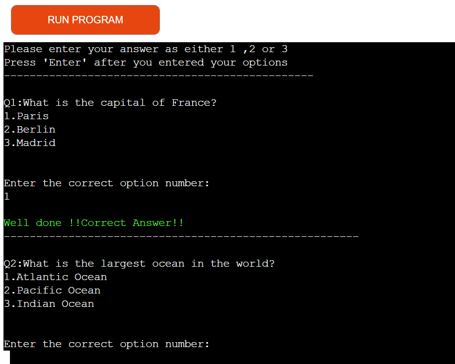
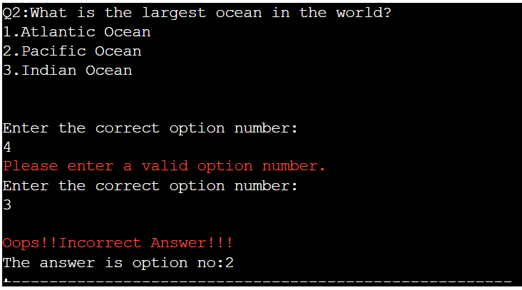
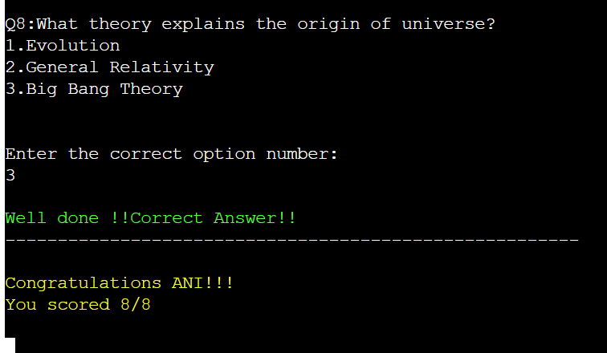

# Quiz Game

Quiz game is a Python terminal game,which runs in the Code Institute mock terminal on Heroku.

Users can play this game on any devices.Each game has 8 general knowledge questions.

## User Stories

- As a visiting user,I am aware that this website test the general knowledge of the user .
- User have to enter their name which only includes less than 8 characters and no numbers accepted.
- There are total 8 questions that needs to be answered.
- After choosing among the three options of answer provided,user can choose the right option number.
- By pressing  the Enter key,the user gets to know whether the answer is right or wrong.
- The usercan only enter either 1,2,or 3.All the other entries return as error.
- By finishing the eight questions ,the user gets the final score of the game.

## Features

### Existing Features

#### Start Page
- The  page displays the welcome message and ask the user to enter the name.
  
- The user should enter the name as only in alphabets less than 8 characters.
- If the userenters their name more than 8 cahracters or in numerics,its displays an error message.  
  

#### Quiz 
- After user enters the name,the instructions are displayed before starting the game.
- The quiz contains the set of one question and three options showed at a time.
  
- The user can pick either 1 ,2 ,03 option and press Enter.
- If the user enters anything other than the three options,user gets an error message.
  ]

#### Score Area
- If the user enters the correct answer,user gets a correct answer response immediately.
 

- If the user enters a wrong answer,the user gets the incorrect answermessage.
  

- The question count, counts the questions out of 8. This is useful for the user to know which question they are on and how many are left.

#### Final Result
- when user finally finishes the eight questions ,the user is given the total score of the game.
- If the user scores the all the right answers ,user gets a positive message.
   

- If the user failed to get even one answer wrong,user gets the total score of the game.
  

## Features Left to Implement

- In future,this website may add more features such as a timer,and a previous key option, when user wants to go back to the previous question.  

## Color scheme

- The colors used in this project by adding an external library [colorit](https://pypi.org/project/color-it/).
- In the terminal, 'pip install color-it' was entered and installed the library.
- Red color(Colors.red) is given to validation errors and for incorrect answer message.
- Green color(Colors.green) is given to correct answers.
- Yellow color(Colors.yellow) given for win message and orange for fail message.

## Technology
The technology used in this website is :
  - **Python** language used for creating the game.
  - **Gitpod**  as a workspace.
  - **GitHub**  for version control of the game.
  - **Code institute python essentials template*** for creating the project.
  - **Heroku** for deploying the project.
## Libraries & Frameworks

* [colorit](https://pypi.org/project/color-it/).
  - For coloring the main headings and message alerts ,colorit libraray is used.
* [re](https://docs.python.org/3/library/re.html).
  - The functions in this module let you check if a particular string matches a given regular expression.Used for validating the input user name. 
## Tools

* [Am I Responsive](https://ui.dev/amiresponsive)
* [GitPod](https://www.gitpod.io/)
* [GitHub](https://github.com/)
* [Lucidchart](https://www.lucidchart.com/pages)

## Testing

### Quiz Page
 - When user run the program, the user receives the home page.
   
   

 - User can enter their name  If more than 8 characters or no name entered or any numeric characters entered,user gets a error message.

    

 -  User gets the question displayed and can either 1,2, or 3.If user enters anything other than these options,user gets an error message.

    ]
    
 -  If user enters the correct answer,user gets a positive message saying answer is correct.  
    

 - Also user gets an incorrect answer message if the answer is incorrect.
   
   
 
 - After finishing the eight questions ,the user gets the final result.if all the answers are right the user gets this message.
   
   
 - If the one of the answers is wrong,the user gets this message.
    
    
 
### Validator Testing
 -  PEP8
      - No errors were returned from PEP8online.com.

### Fixed Bugs
   - Fixed the global variable pylint error by creating function and inserting variable in the function.
   - Indent errors and whitespace errors notified by the problems tab in the terminal are fixed.
### Supported Browsers
  - Compatible to Google Chrome.
  - Used chrome stimulator for testing mobile screens.Compatible to all the stimulators in chrome bowser developer tools.

## Deployment
-  This project was deployed using Code Institute's mock terminal for Heroku.

### Heroku
-  Fork or clone this repository in Github.
-  Createa new Heroku App.
-  Set the buildbacks to Python and NodeJs in that order.
-  Link the Heroku app to the repository.
-  Click on Deploy.
### Gitpod 
- In GitHub repository,click on the Gitpod icon on the right hand side .
- Within the Gitpod,open the run.py file
- In terminal,write 'python3 run.py' command.
- The terminal runs the program.

## Credits

  - The content  was taken from [Google](https://www.google.com/quiz/).
  - Code Institute for the deployment Terminal.
  - Fixing my code issues by using [stackoverflow](https://stackoverflow.com/)
  - Fixed bugs with support of my mentor Rohit Sharma.
  